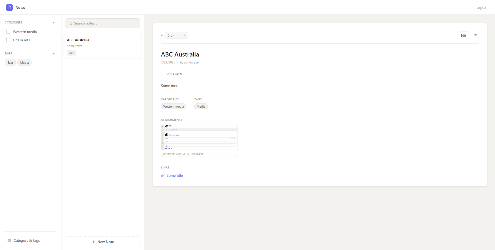

# Notes



A clean, distraction-free note-taking application built with **NestJS**, **Next.js**, **PostgreSQL**, **Drizzle ORM**, and **Turborepo**.

Designed to be simple, conventional, and maintainable without unnecessary abstractions.

---

## Features

* Administrator authentication (JWT)
* Multi-user support
* Notes with Markdown/plain text content
* Categories
* Tags
* File attachments
* External links
* Full-text search
* REST API
* Swagger API documentation
* PostgreSQL + Drizzle ORM
* Local filesystem storage
* Turborepo monorepo

---

## Tech Stack

### Monorepo

* Turborepo
* pnpm

### Backend

* NestJS
* PostgreSQL
* Drizzle ORM
* JWT Authentication
* bcrypt
* Multer
* Swagger

### Frontend

* Next.js (App Router)
* React
* TypeScript

---

## Project Structure

```text
.
├── apps
│   ├── api
│   └── web
│
├── packages
│
├── .env
├── pnpm-workspace.yaml
└── turbo.json
```

---

## Backend Features

### Authentication

* Register
* Login
* JWT authentication
* Password hashing with bcrypt
* Multiple administrators
* OAuth-ready architecture

### Notes

* Create
* Read
* Update
* Delete

Fields

* title
* slug
* summary
* content
* status
* timestamps

### Categories

Many-to-many relationship with notes.

### Tags

Many-to-many relationship with notes.

### Attachments

Supports

* Images
* PDF
* ZIP
* Documents

Uploads are stored locally.

Workflow

```
Upload
    ↓
temp/
    ↓
Database Success?
    ├── Yes → storage/
    └── No  → delete temp file
```

### External Links

Each note can contain multiple URLs.

### Search

Search across

* Title
* Summary
* Content

Filters

* Categories
* Tags
* Author
* Created date
* Updated date
* Date range

---

## API

RESTful endpoints.

Example

```
POST   /auth/register
POST   /auth/login

GET    /notes
GET    /notes/:id
POST   /notes
PATCH  /notes/:id
DELETE /notes/:id

GET    /categories
GET    /tags
```

Swagger documentation is available for every endpoint.

---

## Environment

Root `.env`

```env
DATABASE_URL=
JWT_SECRET=

FILE_STORAGE=
TEMP_STORAGE=
```

The backend loads the root environment using NestJS `ConfigModule`.

The frontend follows standard Next.js conventions with `.env.local`.

---

## Development Principles

This project intentionally avoids unnecessary complexity.

* Official CLIs only
* Conventional project structure
* No experimental tooling
* Minimal abstractions
* Standard NestJS patterns
* Standard Next.js App Router
* Standard Drizzle migrations
* Easy to understand
* Easy to extend

---

## Planned UI

A clean three-column interface inspired by paper note-taking.

```
┌────────────┬───────────────────────┬──────────────────────────┐
│ Categories │       Notes           │      Selected Note       │
│ Tags       │ Search • Filters      │ Content                  │
│ Filters    │ Note List             │ Attachments              │
│            │                       │ URLs • Metadata          │
└────────────┴───────────────────────┴──────────────────────────┘
```

Design goals

* Warm off-white background
* Small typography
* Plenty of whitespace
* Borderless layout
* Minimal controls
* Distraction-free writing experience

---

## Future Improvements

* Rich text editor
* Drag & drop attachments
* Google OAuth
* GitHub OAuth
* Dark mode
* Keyboard shortcuts
* Note history
* Export/Import
* AI-assisted search
* Markdown preview

---

## License

MIT